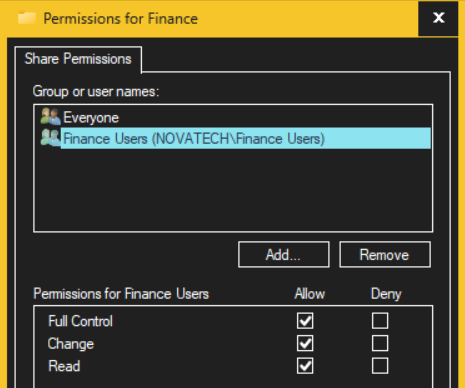
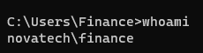
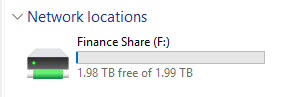
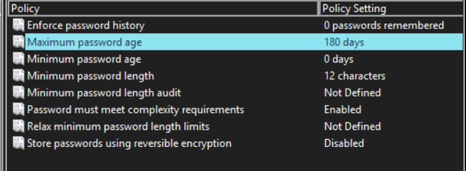
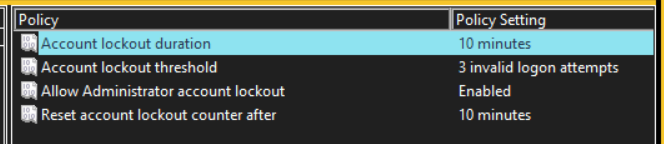

# Active Directory Identity and Access Management Lab

## Overview

This project is a hands-on Active Directory and Identity Access Management lab built using Windows Server and Windows 11 Pro.

The goal of this lab was to simulate an enterprise Windows domain environment where users, groups, permissions, shared resources, and Group Policy are all configured.

This lab focuses on a practical access-control system. Creating a domain user, assigning the user to a security group, granting access to a department's file share, joining a client machine to the domain, and validating access from the client side.

---

## Active Directory Domain Setup

I configured Windows Server as a domain controller and created the novatech.local Active Directory domain. This provided a centralized management system for users, groups, and all client systems.


---

## User and Group Management

For this section of this lab, I created a Finance domain user and a Finance security group inside Active Directory. The user was added to the security group so permissions could be managed through the group membership instead of being assigned directly to the user.


---

## Shared Folder Access Control

I created a Finance shared folder on the Windows Server and made it accessible over the network using:

``\\10.0.0.10\Finance``

The access was managed using the Finance users security group.

Windows shared folder access depends on two permission layers:

- Share permissions
- NTFS permissions

Both permission layers had to be configured correctly for the domain user to access the folder.



---

## Domain Client Testing

After configuring the domain and shared folder, I joined the Windows 11 client machine to the novatech.local domain.

I then logged in using the Finance domain user account that was created earlier and verified the login from the client machine.



## Finance Share Access Test

From the Windows client, I accessed the Finance share using:

```\\10.0.0.10\Finance```

The Finance user was able to access the folder successfully after the correct group-based permissions were applied.



To confirm write permissions, I created a test file inside the Finance share.

## Group Policy Configuration

I configured domain-level password and account lockout policies through Group Policy.

The password policy included:
- Minimum password length: 12 characters
- Password complexity requirements: Enabled
- Maximum password age: 180 days



The account lockout policy included:
- Account lockout threshold: 3 invalid logon attempts
- Account lockout duration: 10 minutes
- Reset account lockout counter after: 10 minutes



These settings demonstrate centralized enforcement of basic account security controls in an Active Directory environment.
